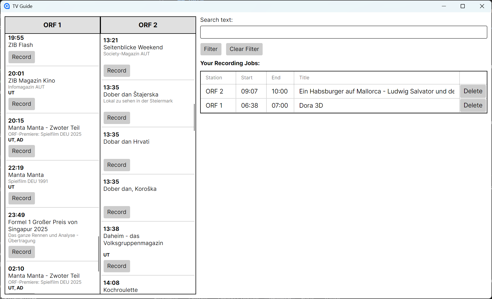

# TV Guide

## Introduction

You job is to implement a part of a user interface for programming a digital video recorder in a smart TV.

## Requirements

Create a Desktop application with Avalonia that looks approximately like this:

```
+----------------------------------------------------------------------------------------------+
|                                                                                              |
|  +---------------+---------------+   Search text: [                                     ]    |
|  | ORF 1         | ORF 2         |   [ Filter ]  [ Clear Filter ]                            |
|  +---------------+---------------+                                                           |
|  | 06:00         | 06:08         |                                                           |
|  | King Julien   | Eishockey...  |   You Recording Jobs:                                     |
|  | ...           | ...           |   +---------+-------+-------+-------------+----------+    |
|  | [ Record ]    | [ Record ]    |   | Station | Start | End   | Title       |          |    |
|  +---------------+---------------+   +---------+-------+-------+-------------+----------+    |
|  | 06:22         | 07:00         |   | ORF 1   | 20:15 | 22:19 | Manta Manta | [Delete] |    |
|  | Mister Paper  | Wetterpanorama|   | ORF 2   | 17:00 | 17:08 | ZIB         | [Delete] |    |
|  | ...           | ...           |   | ...                                              |    |
|  | [ Record ]    | [ Record ]    |   | ...                                              |    |
|  +---------------+---------------+   | ...                                              |    |
|  | ...           | ...           |   | ...                                              |    |
|  +---------------+---------------+   +---------+-------+-------+-------------+----------+    |
|                                                                                              |
+----------------------------------------------------------------------------------------------+
```

Example for screen layout:



On the left, the channels _ORF 1_ and _ORF 2_ are listed. The table shows a list of all programs for the corresponding channel sorted by start time. For each program, you must display:

* Start time
* Title
* Subtitle (if available)
* UT (German "Untertitel", subtitle) and/or AD (German "Audio Deskription", audio description) markers (if available)
* A button _Record_ to add the program to the recording jobs

On the top right, your program offers the functionality to filter the channel list (table on the left). If the user clicks _Filter_, only display programs that contain the search text in the title or subtitle. If the user clicks _Clear Filter_, display all programs again. _Filter_ can only be clicked if the search text is not empty.

On the bottom right, the recording jobs are listed. For each recording job, you must display:

* Station (_ORF 1_ or _ORF 2_)
* Start time
* End time (start time of the following program; empty if the program is the last one)
* Title
* A button _Delete_ to remove the recording job

## Data

The specification contains a JSON file with the data for the programs (`tvguide.json`). You can use this data to populate the program list on the left.

Store the recording jobs in a database. You do **not need to store the programs in the database**, only recording jobs. For each recording job, you must store:

* Station (_ORF 1_ or _ORF 2_)
* Start time
* End time (start time of the following program; empty if the program is the last one)
* Title

## Technical Requirements

* You solution must be written in C# and .NET 9.
* Use the provided starter code as a basis. Do **not** change the project settings or add any new packages.

## Implementation Tips

* Ideally, the UI is responsive and reacts gracefully to window size changes.
* Consider using a `Grid` for the overall layout.
* **Do not use absolute positioning.** Use layout controls like `Grid`, `StackPanel`, `DockPanel`, etc. to position the components.
* Use one of the following control to display the programs/recording jobs (documentation of the controls can be found in the [_docs_](./docs) folder):
  * `ItemsControl` within a `ScrollViewer` (recommended for program list)
  * `ListBox`
  * `DataGrid` (recommended for recording jobs list)
* Consider a `DataTemplate` for the `ItemsControl.ItemTemplate` to display the programs.
* Use data binding to bind the data to the UI.

## Minimum Requirements

* Program compiles without errors.
* Program starts without errors.
* Program list is displayed. Each entry is a simple string with start time and title.
* There is some way of adding a recording job to the database and the recording job list. It does not need to be a button in the program list.
* Recording jobs are read from the database when the program starts and displayed in the recording jobs list.
