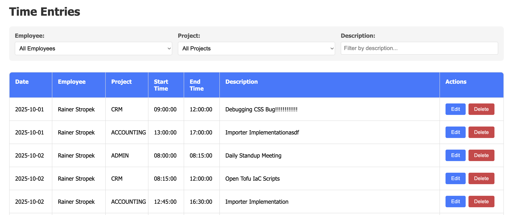
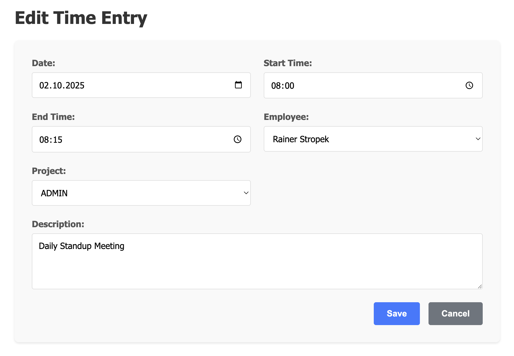

# Time Sheet Manager

## Overview

Your company employs a lot of freelancers. Each freelancer submits time sheets on a regular basis, which you need to process for invoicing.

Your task is to implement a time sheet management application with the following features:

* Stores time sheet records in an SQLite database
* Offers a command-line importer tool to import time sheet data from text files
* Offer a browser-based user interface to view and manage time sheet records

## Time Tracking Import File Format

You can find the detailed, technical specification of the time tracking import file format in the [file-format-specification.md](file-format-specification.md) document. The folder _data_ contains sample import files for testing purposes (valid and invalid ones). Make yourself familiar with the format before you start implementing the importer tool.

## Functional Requirements

### Importer

Implement the importing logic in [`starter/AppServices/Importer`](./starter/AppServices/Importer/). You must add code to `TimesheetParser.cs` and `TimeseetImportDatabaseWriter.cs`. Take a close look at the code comments because they contain important requirements.

The starter code contains lots of unit tests for the importer logic. Run them to verify your implementation.

### Web API

Add the following web API endpoints to [`starter/WebApi`](./starter/WebApi/):

* GET `/employees` - returns a list of all employees
* GET `/projects` - returns a list of all projects
* GET `/timeentries` - returns a list of time entries with optional filters for employee ID and/or project ID
* GET `/timeentries/{id}` - returns a specific time entry by ID
* PUT `/timeentries/{id}` - updates a specific time entry by ID (All fields except ID should be updatable; validate input data)
* DELETE `/timeentries/{id}` - deletes a specific time entry by ID

Add at least three meaningful integration tests for the web API in the [`starter/WebApiTests`](./starter/WebApiTests/) project.

### Web UI

Note: The screenshots below are for illustration purposes only. You don't need to implement the UI exactly as shown in the screenshots, but the required features must be present. The UI should be user-friendly and clean, though.

No end-to-end tests are required for the web UI.

#### Time Entry List

Implement a grid view to display time entries. The grid should support the following features:

* Optional filter for a project (filtering must be done on the server-side)
* Optional filter for an employee (filtering must be done on the server-side)
* Optional filter by description text (_contains_ search; filtering must be done on the client-side)
* Option to delete a time entry
* Option to open a time entry for editing

#### Time Entry Edit

Implement a form to edit a time entry. The form should support the following features:

* Edit all fields except the ID
* All fields must be mandatory
* Display potential errors returned by the API (e.g. validation failures)
* _Save_ button to save changes and return to the time entry list
* _Cancel_ button to discard changes and return to the time entry list

