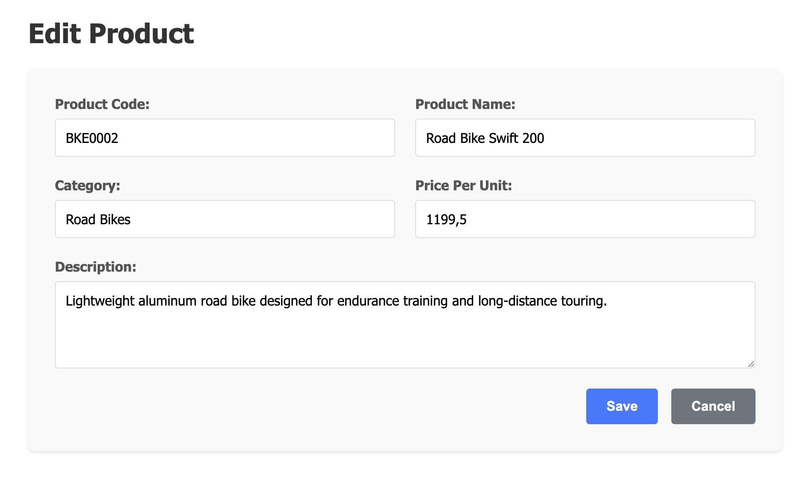

# Product Manager

## Overview

Your company manages a large inventory of products. Product data is regularly imported from suppliers and needs to be processed for inventory management.

Your task is to implement a product management application with the following features:

* Stores product records in an SQLite database
* Offers a command-line importer tool to import product data from text files
* Offer a browser-based user interface to view and manage product records

## Product Import File Format

You can find the detailed, technical specification of the product import file format in the [file-format-specification.md](file-format-specification.md) document. The folder [_data_](./data/) contains sample import files for testing purposes (valid and invalid ones). Make yourself familiar with the format before you start implementing the importer tool.

## Functional Requirements

⚠️ **Tip:** Use the extension _Todo Tree_ in Visual Studio Code to get an overview of all TODO comments in the codebase.

### Importer

Implement the importing logic in [`solution/AppServices/Importer`](./solution/AppServices/Importer/). You must add code to `TypedCsvParser.cs` and `ProductsImportDatabaseWriter.cs`. Take a close look at the code comments because they contain important requirements.

The starter code contains lots of unit tests for the importer logic. Run them to verify your implementation.

### Web API

Add the following web API endpoints to [`solution/WebApi`](./solution/WebApi/):

* GET `/categories` - returns a list of all unique product category values
* GET `/products` - returns a list of all products with optional filters for category and/or max unit price
* GET `/products/{id}` - returns a specific product by ID
* PUT `/products/{id}` - updates a specific product by ID (All fields except ID should be updatable; validate input data)
* DELETE `/products/{id}` - deletes a specific product by ID

Add at least three meaningful integration tests for the web API in the [`solution/WebApiTests`](./solution/WebApiTests/) project.

### Web UI

Note: The screenshots below are for illustration purposes only. You don't need to implement the UI exactly as shown in the screenshots, but the required features must be present. The UI should be user-friendly and clean, though.

No end-to-end tests are required for the web UI.

#### Product List

Implement a grid view to display products. The grid should support the following features:

* Optional filter for a category (filtering must be done on the server-side)
* Optional filter by maximum unit price (filtering must be done on the server-side)
* Filters must be triggered by clicking a _Search_ button (not automatically)
* Option to delete a product
* Option to open a product for editing

#### Product Edit

Implement a form to edit a product. The form should support the following features:

* Edit all fields except the ID
* Product code, product name, and price per unit are mandatory fields
* Product description and category are optional fields
* The category field is a string field (no dropdown)
* Display potential errors returned by the API (e.g. validation failures)
* _Save_ button to save changes and return to the product list
* _Cancel_ button to discard changes and return to the product list

## Non-Functional Requirements

* Use C# and .NET for the backend implementation
* Use Angular for the frontend implementation (standalone components, signals)
* Use SQLite as the database
* Follow best practices for code structure, naming conventions, and design patterns

## Minimum Requirements

* The code must compile without errors
* The importer must be able to correctly import **valid** product files
* The product list must display all products, without filtering
* It must be able to navigate to the product edit form. Product data must be displayed correctly. Saving of changes is not required to pass the exam.
