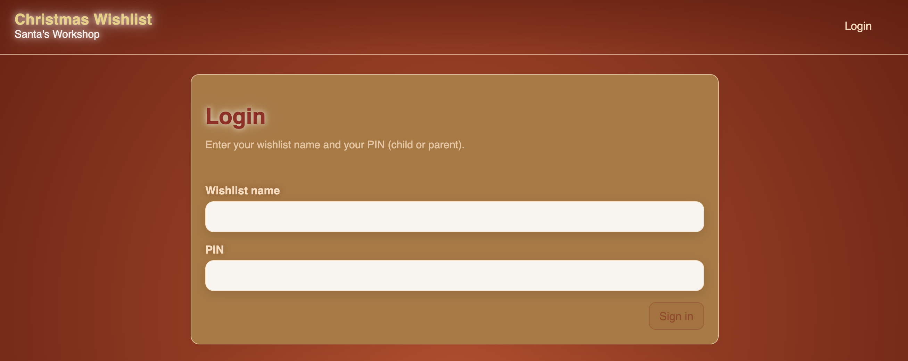
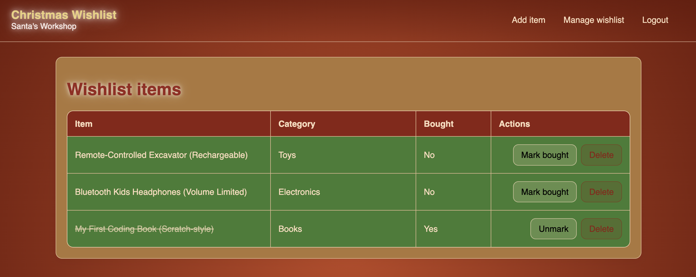
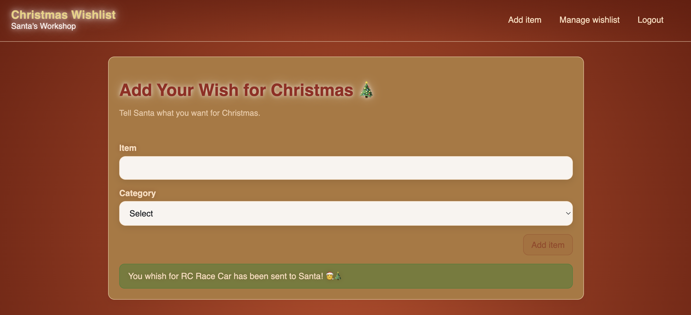

# Christmas Whishlist

## Overview

You are working as an elf in Santa's workshop, and your task is to create a simple application that allows children to submit their Christmas wishlists. The application works as follows:

- One family member (the "parent") can create a whishlist. Each wishlist has a unique name.
- In addition to the unique ID, the system generates two PIN codes: A "parent PIN" and a "child PIN".
- The children "sign in" to the wishlist using the unique ID and the child PIN. They can then add items to the wishlist.
- The parent "signs in" to the wishlist using the unique ID and the parent PIN. They can then manage the wishlist (add/remove items, view all items, etc.).

## Data Model

The data model is part of the starter code ([DatabaseModel.cs](./starter/AppServices/DatabaseModel.cs)). Use it as it is. You do not need to modify it.

- Wishlist
  - ID (system-assigned, numeric identifier, PK in DB)
  - Name (unique string identifier, max. 100 chars)
  - Parent PIN (system-assigned, string, 6 chars)
  - Child PIN (system-assigned, string, 6 chars)
- Gift Category (e.g. Toys, Books, Electronics)
  - ID (system-assigned, numeric identifier, PK in DB)
  - Name (string, max. 50 chars)
- Wishlist Item
  - ID (system-assigned, numeric identifier, PK in DB)
  - Wishlist ID (FK to Wishlist)
  - Category ID (FK to Gift Category)
  - Item Name (string, max. 100 chars)
  - Bought flag (boolean, only visible and manageable by parent)

When PINs are entered, they are checked in a case-insensitive manner.

## Importer

The new wishlist application should come with an importer that allows importing existing wishlists from JSON files. You can find JSON files to import in the [data](./data/) folder.

- The importer receives a folder path as an argument. It scans the folder for all \*.json files.
- Each JSON file contains a single wishlist with its items (see examples in the [data](./starter/data/) folder). The importer can assume that the JSON files are well-formed and valid. No error handling for malformed files is required.
- If a wishlist with the same name already exists in the system, the importer skips that wishlist and continues with the next one.
- After importing, the importer outputs a summary report indicating how many wishlists were successfully imported and how many were skipped due to name conflicts.
- The importer must check if the categories of the items already exist in the system. If a category does not exist, it should be created during the import process.

The starter code already contains helper classes for the importer ([Importer](./starter/AppServices/Importer/)). **Make yourself familiar with the existing code**. Reading and understanding the existing code is part of the exam.

Once you understand the existing code, implement the missing part in [WishlistImporter.cs](./starter/AppServices/Importer/WishlistImporter.cs) to complete the importer functionality. The starter code contains unit tests that you can use to verify your implementation.

## Web API

Implement the following endpoints for the web API in the [WebApi](./starter/WebApi/) project.

| Endpoint                                       | Method   | Who      | Description                                                |
| ---------------------------------------------- | -------- | -------- | ---------------------------------------------------------- |
| `/verify-pin/:name`                            | `POST`   | Everyone | Check PIN, return who the PIN belongs to (parent or child) |
| `/wishlist/:name/items`                        | `POST`   | Parent   | Retrieve the wishlist items (POST because of auth)         |
| `/wishlist/:name/items/:itemId/mark-as-bought` | `POST`   | Parent   | Mark an item as bought                                     |
| `/wishlist/:name/items/:itemId`                | `DELETE` | Parent   | Delete an item from the wishlist                           |
| `/wishlist/:name/items/add`                    | `POST`   | Everyone | Add a new item to the wishlist                             |
| `/gift-categories`                             | `GET`    | Everyone | Retrieve all gift categories (no auth needed)              |

Note that authentication is done using the wishlist name and the appropriate PIN (parent or child) provided in the request body. Every request (except `/gift-categories`) must be authenticated. The web API must verify the PIN for each request and ensure that the user has the necessary permissions to perform the requested action.

**Side note:** In practice, you would use a more sophisticated authentication mechanism, such as JWT tokens, but because of time constraints during the exam, we will use this simplified approach.

It is your responsibility to design the request and response bodies for each endpoint.

## Integration Tests

Add at least three meaningful integration tests for the web API in the [WebApiTests](./starter/WebApiTests/) project.

## Frontend

The starter code contains HTML templates with CSS, but no logic. Implement the missing TypeScript logic for the required [pages](./starter/Frontend/src/app/pages/) and add proper data binding to the HTML templates.

### Authentication

The login page allows the user to enter their wishlist name and PIN. Upon submission, the login page calls the `/verify-pin/:name` endpoint to verify the PIN and determine if the user is a parent or child. If the PIN is valid, store the wishlist name and PIN in the Angular service (already part of the starter code, [session.service.ts](./starter/Frontend/src/app/services/session.service.ts)) and redirect the user to the appropriate page:
  - Parent: Redirect to the wishlist page, where the user can view all items, mark items as bought, and delete items.
  - Child: Redirect to page where they can add new items to the wishlist.
  - The parent must also have the possibility to navigate to the page where they can add new items to the wishlist.

Store the current user's wishlist name and PIN in an Angular service that must be injected into all components that need it.

If the user is not authenticated (i.e., no wishlist name and PIN are stored in the service) and tries to access any page other than the login page, redirect them to the login page.

**Side note:** In practice, you would protect pages using *Angular route guards*, but because of time constraints during the exam, you can skip that part. Instead, we rely on the backend to enforce the permissions. If a child tries to access a parent-only endpoint, the backend will return an error.

### Whishlist Page (only Parent)

Display a list of all items in the wishlist.

Let the user mark items as bought and delete items. Call the appropriate web API endpoints to perform these actions.

### Add Item Page (Parent and Child)

Allow the user to add a new item to the wishlist. The category field must be a dropdown menu that is populated with the list of categories retrieved from the `/gift-categories` endpoint. Call the appropriate web API endpoint to add the new item to the wishlist.

If the user successfully added an item, display a success message (see image above). The user must stay on the same page to add more items if they want.

## Technologies

- Hosting: Aspire
- Backend: .NET
  - ASP.NET Core Web API
  - Entity Framework Core with SQLite
- Frontend: Angular 21
  - Standalone components
  - Signals
  - Signals in Forms
  - Generated API client using OpenAPI (`npm run generate-web-api` in the Frontend project)

## Grading Criteria

To pass the exam, your solution must meet the following criteria:

- Compiles without errors
- Importer works
- The following web API endpoints are implemented:
  - `/verify-pin/:name`
  - `/wishlist/:name/items`
  - `/wishlist/:name/items/add`
- The folllowing frontend features are implemented:
  - Login
  - Wishlist page without "mark as bought" and "delete" functionality
  - _Add wish_ page with category as an input field (no dropdown) and without success message

If your solution meets all of the above criteria, your grade depends on the quality and completeness of your implementation.
