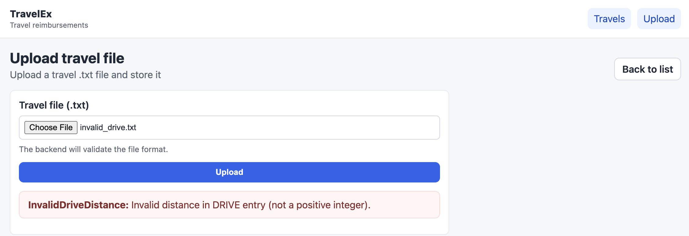
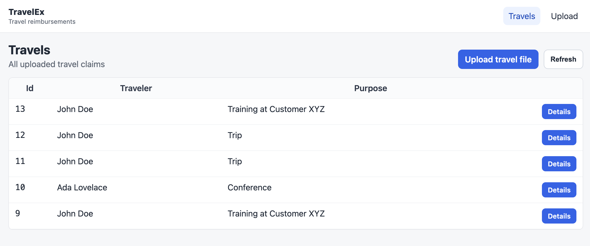
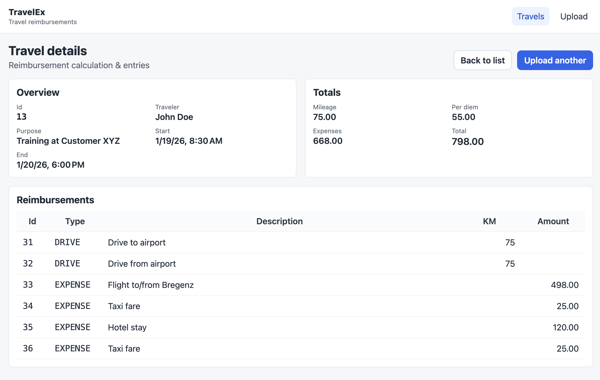

# Reisekostenabrechnung

## Einleitung

Ihre Aufgabe ist die Entwicklung einer Software zum Berechnen der Reisekosten entsprechend der österreichischen Richtlinien. Folgende Vereinfachungen und Annahmen gelten:

* Die Software kann nur Reisen innerhalb Österreichs verarbeiten. Grenzübertritte und Auslandsreisen werden nicht berücksichtigt.
* Wenn Fahren mit PKWs gemeldet werden, wird davon ausgegangen, dass es sich um Privat-PKWs handelt.
* Wenn Barauslagen gemeldet werden, wird davon ausgegangen, dass diese tatsächlich angefallen sind und dienstrelevante Ausgaben darstellen.

Die Regeln für das Berechnen der Reisekosten sind in [calculation-logic.md](./calculation-logic.md) im Detail beschrieben. Sie wurden mit minimalen Vereinfachungen von den offiziellen Richtlinien in Österreich (Quelle: WKO) übernommen.

## Funktionale Anforderungen

### US1: Reisekostenabrechnung hochladen

In diesem Beispiel gehen wir davon aus, dass Reisen in einer vorgelagerten Software erfasst und in einem standardisierten Format exportiert werden können. Das Dateiformat ist in [travel-file-spec.md](./travel-file-spec.md) im Detail beschrieben. Der Ordner [data](./data/) enthält Beispieldateien (korrekte und fehlerhafte).

Als Benutzer:in möchte ich eine Reisekostenabrechnungsdatei im spezifizierten Format hochladen können, um meine Reisekosten berechnen zu lassen.

### US2: Übersicht über alle Reisen anzeigen

Als Benutzer:in möchte ich eine Übersicht über alle meine hochgeladenen Reisen sehen können.

Akzeptanzkriterien:
- Die zuletzt hochgeladene Reise wird ganz oben in der Liste angezeigt, danach absteigend sortiert nach Erfassungszeitpunkt (ID kann verwendet werden).
- Die Liste muss den Reisenden und den Zweck der Reise anzeigen.
- Es muss eine Möglichkeit zur Navigation zur Detailansicht jeder Reise geben.
- Es muss eine Möglichkeit zur Navigation zum Hochladen einer neuen Reise geben.

### US3: Detaillierte Ansicht einer Reise

Als Benutzer:in möchte ich die Details einer einzelnen Reise einsehen können, einschließlich aller Reisekosten.

Akzeptanzkriterien:
- Die Detailansicht muss alle Informationen beinhalten, die in der oben dargestellten Abbildung gezeigt werden.
- Es muss eine Möglichkeit zur Navigation zurück zur Übersicht aller Reisen geben.
- Es muss eine Möglichkeit zur Navigation zum Hochladen einer neuen Reise geben.

## Qualitätsanforderungen

### Startercode

Es muss der Startercode aus dem Ordner [starter](./starter/) verwendet werden. Es müssen die dort enthaltenen Technologien zum Einsatz kommen.

Der Startercode enthält "TODO"-Kommentare, die anzeigen, wo Code ergänzt werden muss.

Folgende Dinge sind im Startercode fertig implementiert:

* Grundlegende Projektstruktur
* Datenbankzugriff mit Entity Framework Core
* Web-API und Frontend-Logik zum Hochladen von Dateien (**Tipp:** Machen Sie sich mit dem Code vertraut, da wir bisher diese Aspekte im Unterricht nicht behandelt haben)
* Unit- und Integrationstests für Parser und API-Endpunkte (manche Tests müssen erweitert werden, siehe unten)
* CSS und HTML-Grundgerüste für die Frontend-Komponenten (ohne Data Binding und Logik)

### Zu ergänzender Code

* [TravelFileParser.cs](./starter/AppServices/TravelFileParser.cs): Implementierung des Parsers für das Reisekostendateiformat.
* [Reimbursement.cs](./starter/AppServices/Reimbursement.cs): Implementierung der Logik zur Berechnung der Reisekosten.
* [ReiumbursementCalculatorTests.cs](./starter/AppServicesTests/ReimbursementCalculatorTests.cs): Fügen Sie mindestens fünf Unit-Tests hinzu, die die Berechnung der Reisekosten abdecken. Die Unit-Tests müssen Testfälle abdecken, die in [calculation-logic.md](./calculation-logic.md) beschrieben sind.
* [TravelEndpoints.cs](./starter/WebApi/TravelEndpoints.cs): Ergänzen Sie die API-Endpunkte, um die Anforderungen der Benutzerstories zu erfüllen.
* [travels-list](./starter/Frontend/src/app/travels-list/): Ergänzen Sie die Komponente, um die Anforderungen der Übersicht aller Reisen zu erfüllen.
* [travel-details](./starter/Frontend/src/app/travel-details/): Ergänzen Sie Sie die Komponente, um die Anforderungen der Detailansicht einer Reise zu erfüllen.

---

# Travel Expense Reimbursement

## Introduction

Your task is to develop a software solution for calculating travel expenses according to Austrian guidelines. The following simplifications and assumptions apply:

* The software can only process trips within Austria. Border crossings and international travel are not considered.
* If driving by car is reported, it is assumed to be a private car.
* If cash expenses are reported, it is assumed that they actually occurred and are work-related expenses.

The rules for calculating travel expenses are described in detail in [calculation-logic.md](./calculation-logic.md). They are based on the official Austrian guidelines (source: WKO) with minimal simplifications.

## Functional Requirements

### US1: Upload travel expense report

In this example, we assume that trips are recorded in an upstream system and can be exported in a standardized format. The file format is described in detail in [travel-file-spec.md](./travel-file-spec.md). The folder [data](./data/) contains example files (valid and invalid).

As a user, I want to be able to upload a travel expense report file in the specified format so that my travel expenses can be calculated.

### US2: Show overview of all trips

As a user, I want to see an overview of all trips I have uploaded.

Acceptance criteria:
- The most recently uploaded trip is shown at the top of the list, then sorted descending by creation time (the ID may be used).
- The list must show the traveler and the purpose of the trip.
- There must be a way to navigate to the detail view of each trip.
- There must be a way to navigate to uploading a new trip.

### US3: Detailed view of a trip

As a user, I want to view the details of a single trip, including all travel expenses.

Acceptance criteria:
- The detail view must include all information shown in the screenshot above.
- There must be a way to navigate back to the overview of all trips.
- There must be a way to navigate to uploading a new trip.

## Quality Requirements

### Starter code

You must use the starter code from the folder [starter](./starter/). The technologies included there must be used.

The starter code contains "TODO" comments indicating where code needs to be added.

The following things are already implemented in the starter code:

* Basic project structure
* Database access with Entity Framework Core
* Web API and frontend logic for uploading files (**Tip:** Familiarize yourself with the code, as we have not covered these aspects in class yet)
* Unit and integration tests for the parser and API endpoints (some tests need to be extended, see below)
* CSS and HTML skeletons for the frontend components (without data binding and logic)

### Code to be added

* [TravelFileParser.cs](./starter/AppServices/TravelFileParser.cs): Implement the parser for the travel expense file format.
* [Reimbursement.cs](./starter/AppServices/Reimbursement.cs): Implement the logic for calculating travel expenses.
* [ReiumbursementCalculatorTests.cs](./starter/AppServicesTests/ReimbursementCalculatorTests.cs): Add at least five unit tests covering travel expense calculation. The unit tests must cover cases described in [calculation-logic.md](./calculation-logic.md).
* [TravelEndpoints.cs](./starter/WebApi/TravelEndpoints.cs): Extend the API endpoints to meet the requirements of the user stories.
* [travels-list](./starter/Frontend/src/app/travels-list/): Extend the component to meet the requirements for the overview of all trips.
* [travel-details](./starter/Frontend/src/app/travel-details/): Extend the component to meet the requirements for the detailed trip view.
