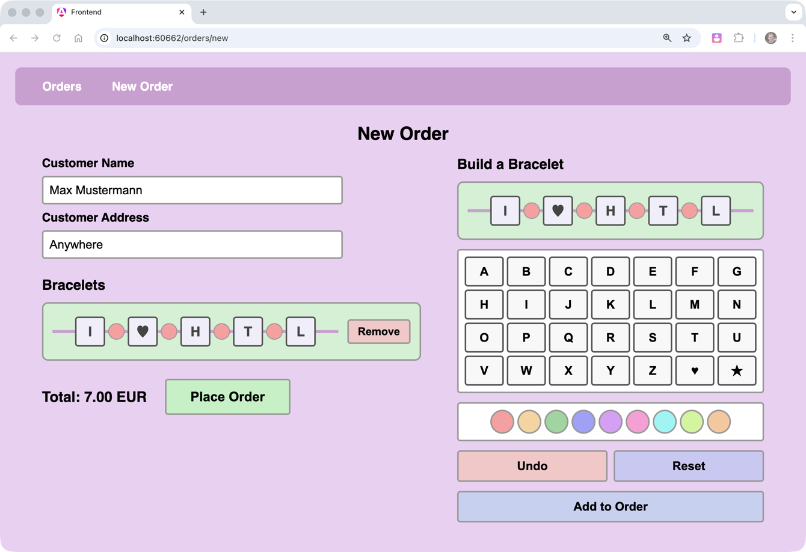

# Friendship Bracelet Builder - Exam

## Introduction

In this exam, you will work on a web application for designing and ordering custom friendship bracelets. Users can compose bracelets from letter cubes (A–Z, ♥, ★) and colored spacer beads, then place orders containing one or more bracelets. The app validates bracelet designs, calculates costs, and manages orders.

**Business rules:**

- A bracelet follows the pattern: letter, spacer, letter, spacer, …, letter (always starts and ends with a letter).
- Maximum 10 letters per bracelet.
- Valid spacer colors: pink, peach, mint, blue, purple, rose, cyan, lime, sand.
- Pricing: letter cubes cost **1.00 EUR** each, spacer beads cost **0.50 EUR** each.
- If a bracelet uses spacers of more than one color, a **mixed-color warning** is shown.

## Tech Stack

- **.NET 9** backend with **ASP.NET Core Minimal API**
- **Entity Framework Core** with **SQLite**
- **Angular 21** frontend
- **.NET Aspire** for orchestration
- Auto-generated TypeScript API client via **ng-openapi-gen**

You are already familiar with this stack. The starter code contains the full project structure, existing components (bracelet builder, bracelet preview), services, and styling. Your job is to implement the missing logic.

## UI Reference Video

Watch [UI-Video.mp4](UI-Video.mp4) to see how the finished application should look and behave.

## Your Tasks

All places where you need to add code are marked with `TODO` comments in the starter code. Below is a complete list.

### Backend (C# / .NET)

#### 1. `Bracelet` Constructor (`AppServices/Bracelet.cs`)

Implement the constructor to initialize all properties from the given `parts` list.

#### 2. `BraceletSerializer.Parse` (`AppServices/BraceletSerializer.cs`)

Implement the parsing and validation logic for pipe-delimited bracelet strings.

#### 3. Web API Endpoints (`WebApi/OrderEndpoints.cs`)

Design and implement RESTful endpoints for bracelet orders. You need to define the API routes, DTOs (Data Transfer Objects), and the endpoint logic yourself. Required functionality:

- **Get all orders** — list orders with optional minimum cost filter, ordered by date descending. Return id, customer name, order date, total costs, and number of bracelets.
- **Get order by ID** — return full order details including all bracelet items. Return 404 if not found.
- **Create order** — accept customer name, address, and a list of bracelet data strings. Validate all inputs (name/address required, at least one bracelet, all bracelets must be valid). Calculate costs server-side.
- **Validate bracelet** — accept a bracelet data string, return validation errors, mixed-color warning flag, and cost (if valid).

#### 4. Integration Tests (`WebApiTests/OrderIntegrationTests.cs`)

Write at least **two meaningful integration tests** for your order endpoints. A test fixture (`WebApiTestFixture`) and an example test (`PingIntegrationTests.cs`) are already provided for reference.

### Frontend (Angular)

#### 5. Order Create Component (`Frontend/src/app/order-create/`)

The HTML template and component class need to be wired up:

* Component logic (`order-create.ts`)
* Template bindings (`order-create.html`)

#### 6. Order List Component (`Frontend/src/app/order-list/`)

* Component logic (`order-list.ts`)
* Template bindings (`order-list.html`)

### Not Required

The **order view page** (`order-view`) is explicitly **not** part of this exam. You do not need to implement it.

## Grading

**To pass the exam**, you must implement a basic working version of the **order-create component** that can submit an order (customer data + at least one bracelet) to the backend — without full error handling.

**Beyond passing**, the overall grade depends on:
  - **Completeness** — how many of the tasks above are fully implemented and working
  - **Code quality** — clean coding style, proper API design (RESTful routes, appropriate status codes, meaningful DTOs), and good code structure
