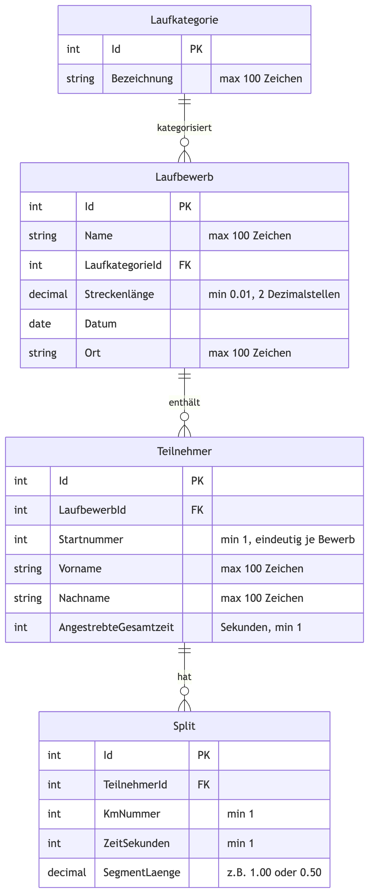
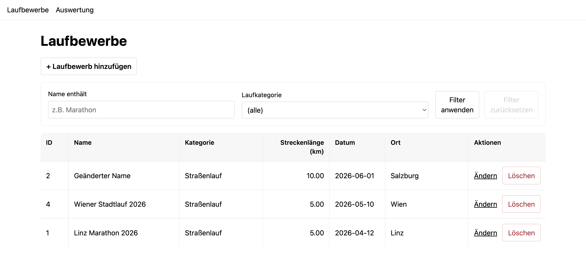
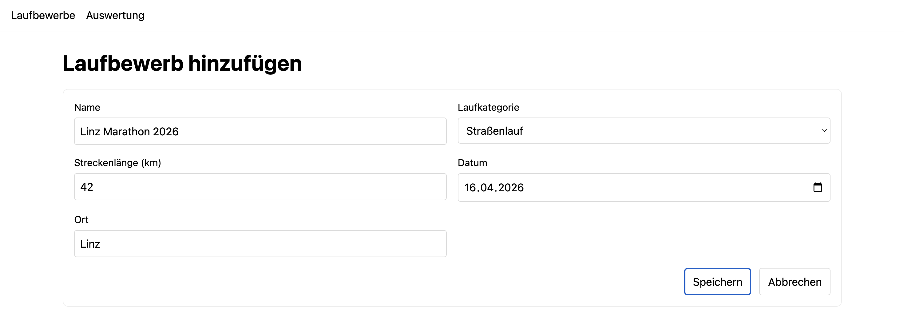
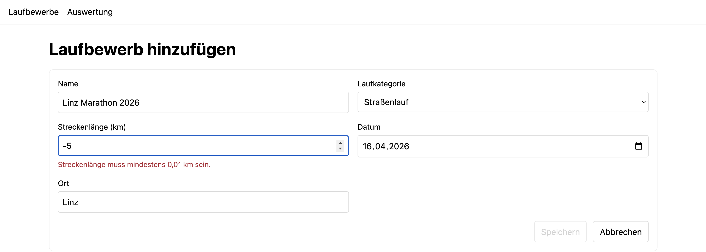
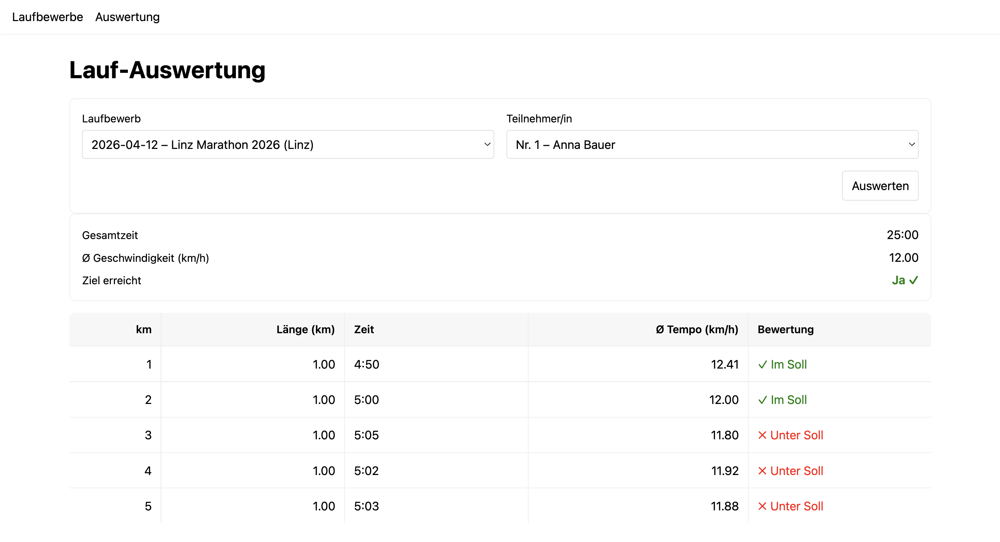

# Laufbewerbs-Auswertung

## Hintergrund

Ihre Aufgabe ist die Entwicklung einer Software zur Verwaltung und Auswertung von Laufbewerben.

Die Software bietet folgende Funktionen:

- Verwaltung der Stammdaten von Laufbewerben (z.B. Name, Streckenlänge, Datum, Ort)
- Möglichkeit zum Importieren von km-Split-Zeiten und zur Auswertung der Laufergebnisse

## Datenmodell und inhaltliche Erklärungen

Das folgende Datenmodell stellt die Beziehungen der verschiedenen Entitäten dar.



> Die Konfiguration der Entitäten und deren Beziehungen, sowie die darauf basierende Migration, sind bereits vollständig vorgegeben => Sie müssen hier _keine_ Erweiterungen oder Veränderungen vornehmen.
> Zusätzliche Werteinschränkungen (z.B. Mindestlänge einer Strecke) sind _nur_ im Code (z.B. Form oder Request Validierung) zu prüfen.

In Folge werden die verschiedenen Entitäten genauer erklärt.

### Laufkategorien

Jeder Laufbewerb gehört genau einer Laufkategorie an. Je Kategorie wird die Bezeichnung gespeichert.

Hier Beispiele für Laufkategorien:

| Bezeichnung |
| ----------- |
| Straßenlauf |
| Crosslauf   |
| Bahnlauf    |
| Trailrun    |

**Wichtiger Hinweis:** Der Startercode fügt die oben genannten Laufkategorien beim Ausführen der _Database Migrations_ automatisch in die Datenbank ein. Sie müssen diese nicht manuell hinzufügen, sondern können direkt mit der Verwaltung der Laufbewerbe beginnen.

### Laufbewerbe

Die Software soll die Möglichkeit bieten, eine Liste von Laufbewerben zu verwalten. Je Bewerb werden folgende Daten erfasst:

- Name (z.B. _Linz-Marathon 2026_, max. 100 Zeichen)
- Verweis auf Laufkategorie (siehe oben)
- Streckenlänge in km, mit genau zwei Dezimalstellen (z.B. _10.50_ für 10,5 km, mindestens _0.01_)
- Datum (ohne Zeitangabe)
- Ort (max. 100 Zeichen)

Hier ein Beispiel für eine Liste von Laufbewerben:

| Name                        | Kategorie   | Streckenlänge | Datum      | Ort  |
| --------------------------- | ----------- | ------------- | ---------- | ---- |
| Wiener Stadtlauf 2026       | Straßenlauf | 5.00          | 2026-04-20 | Wien |
| Donaulauf Linz 2026         | Crosslauf   | 10.50         | 2026-05-03 | Linz |
| Frühjahrstestlauf Graz 2026 | Bahnlauf    | 3.00          | 2026-03-15 | Graz |

### Läufer:innen

Zu jedem Laufbewerb können Läufer:innen gespeichert werden. Je Läufer:in werden folgende Daten erfasst:

- Startnummer (positive ganze Zahl, muss je Laufbewerb eindeutig sein)
- Vorname (max. 100 Zeichen)
- Nachname (max. 100 Zeichen)
- Angestrebte Gesamtzeit für diesen Bewerb, gespeichert in Sekunden. Die Eingabe erfolgt im Format `(HH:)MM:SS`:
  - Ohne Stunden, z.B. `25:00` für 25 Minuten
  - Mit Stunden, z.B. `1:05:00` für 1 Stunde und 5 Minuten
  - Sekunden und Minuten müssen immer zweistellig angegeben werden (00–59)

Läufer:innen werden nicht als eigenständige Stammdaten über mehrere Bewerbe hinweg verwaltet. Sie werden beim Importieren von Split-Daten (Teilaufgabe 2) automatisch angelegt und sind immer einem bestimmten Laufbewerb zugeordnet.

### Km-Splits

Zu jeder Läufer:in werden die Abschnittszeiten (_Splits_) für jeden gelaufenen Kilometer gespeichert:

- KmNummer: laufende Nummer des km-Abschnitts (1, 2, 3, …)
- ZeitSekunden: benötigte Zeit für diesen Abschnitt in Sekunden
- SegmentLänge: tatsächliche Länge des Abschnitts in km (1.00 für alle vollständigen km; bei nicht-ganzzahliger Streckenlänge ist der letzte Abschnitt kürzer, z.B. 0.50 für die letzten 500 m)

Beispiel: Bei einem Bewerb mit 10.50 km Streckenlänge gibt es 11 Abschnitte. Die ersten 10 Abschnitte haben eine SegmentLänge von 1.00, der 11. Abschnitt hat eine SegmentLänge von 0.50.

## Technische Rahmenbedingungen

### Projektstruktur

Sie erhalten als Grundlage für die Ausarbeitung dieses Beispiels eine fertige Projektstruktur. Die Projekte enthalten zum Teil bereits bestehenden Code (inkl. Datenmodell) sowie automatisierte Tests. Machen Sie sich mit dem Code vertraut, bevor Sie zu arbeiten beginnen.

Die bestehenden Projekte enthalten alle für die Lösung des Beispiels notwendigen Abhängigkeiten (NuGet, NPM). Sie dürfen **keine weiteren Abhängigkeiten** zu den Projekten hinzufügen. Stellen Sie vor dem Start Ihrer Arbeiten sicher, dass Sie die Projekte kompilieren und ausführen können.

### Verwendete Technologien

- .NET 9, C#, Entity Framework Core zum Zugriff auf eine relationale Datenbank
- Angular 21, TypeScript für die Benutzeroberfläche

## Teilaufgabe 1

Ihre Aufgabe ist die Entwicklung von Backend- und Frontend-Komponenten zur Verwaltung von Laufbewerben. Benutzer:innen sollen in die Lage versetzt werden, Laufbewerbe zu verwalten (hinzufügen, löschen, auflisten, filtern).

### Laufbewerb-Liste



Zeigen Sie eine Liste aller Laufbewerbe an. Die Liste muss folgende Daten pro Bewerb anzeigen:

- ID (automatisch generiert, PK in der Datenbank)
- Name
- Laufkategorie (Bezeichnung der Kategorie)
- Streckenlänge (in km, 2 Dezimalstellen, z.B. _10.50_)
- Datum
- Ort

Die Liste muss nach Datum absteigend sortiert sein. Die Sortierung muss im Backend erfolgen, nicht im Frontend.

Die Liste muss nach Name (Prüfung mit _contains_) und Laufkategorie (_Dropdown_) filterbar sein. Das Filtern muss im Backend erfolgen, nicht im Frontend.

Eine Pagination der Liste ist nicht erforderlich. Sie können davon ausgehen, dass die Anzahl der Laufbewerbe unter 50 bleibt.

### Laufbewerbe löschen

In der Liste muss es eine Schaltfläche geben, mit der ein Laufbewerb gelöscht werden kann. Vor dem Löschen muss eine Bestätigungsabfrage erfolgen.

Beim Löschen eines Laufbewerbs werden alle dazugehörigen Läufer:innen und deren Splits automatisch mitgelöscht (Cascade Delete).

### Laufbewerbe hinzufügen und ändern



Ermöglichen Sie das Hinzufügen und Ändern von Laufbewerben. Beim Ändern sind alle Felder änderbar, außer der ID.

Es muss eine Schaltfläche geben, mit der ein Formular zum Hinzufügen eines neuen Laufbewerbs geöffnet wird (eigene Angular Route oder Komponente). Bei jedem Listeneintrag muss es eine Schaltfläche geben, mit der ein Formular zum Ändern des Laufbewerbs geöffnet wird. Verwenden Sie zum Hinzufügen und Ändern dasselbe Formular (gleiche Angular Route oder Komponente).

Das Formular muss alle Gültigkeitsprüfungen enthalten, die oben im Datenmodell beschrieben sind. Zeigen Sie passende Fehlermeldungen in der Benutzeroberfläche an, wenn die Gültigkeitsprüfungen fehlschlagen. Die Schaltfläche zum Absenden des Formulars muss deaktiviert sein, solange das Formular ungültig ist. Aus Sicherheitsgründen muss auch das Backend die Gültigkeitsprüfungen durchführen, auch wenn die Benutzeroberfläche bereits fehlerhafte Eingaben verhindert.



Nach erfolgreichem Speichern wird zur Liste der Laufbewerbe zurückgekehrt. Falls beim Speichern ein Fehler auftritt (z.B. Datenbankfehler), muss eine aussagekräftige Fehlermeldung angezeigt werden, und der Benutzer bleibt im Formular.

Sehen Sie eine Schaltfläche zum Abbrechen vor, die zur Liste der Laufbewerbe zurückführt, ohne zu speichern.

### Web API

Die gesamte Kommunikation zwischen Frontend und Backend muss über eine Web API erfolgen. Erstellen Sie daher die folgenden Web API-Endpunkte:

| HTTP-Methode | URL                 | Beschreibung                                  |
| ------------ | ------------------- | --------------------------------------------- |
| GET          | `/laufbewerbe`      | Liefert die Liste aller Laufbewerbe           |
| GET          | `/laufbewerbe/{id}` | Liefert den Laufbewerb mit der angegebenen ID |
| DELETE       | `/laufbewerbe/{id}` | Löscht den Laufbewerb mit der angegebenen ID  |
| POST         | `/laufbewerbe`      | Fügt einen neuen Laufbewerb hinzu             |
| PATCH        | `/laufbewerbe/{id}` | Ändert den Laufbewerb mit der angegebenen ID  |
| GET          | `/laufkategorien`   | Liefert die Liste aller Laufkategorien        |

Beachten Sie, dass beim PATCH-Endpunkt nur die Felder geändert werden, die im Request angegeben sind. Felder, die im Request fehlen, bleiben unverändert.

### Integrationstests

Fügen Sie mindestens drei sinnvolle Integrationstests hinzu, die die Web API-Endpunkte im Zusammenspiel mit der Datenbank zum Verwalten der Laufbewerbe testen. Hier Beispiele für sinnvolle Testszenarien:

- Einfügen/Auflisten:
  - Einfügen eines neuen Laufbewerbs mit gültigen Daten
  - Abrufen der Liste aller Laufbewerbe und Überprüfung, ob der neu eingefügte Bewerb in der Liste enthalten ist
- Einfügen/Löschen:
  - Einfügen eines neuen Laufbewerbs mit gültigen Daten
  - Löschen des neu eingefügten Laufbewerbs
  - Versuchen, den gelöschten Laufbewerb per ID abzurufen und Überprüfung, ob ein 404-Fehler zurückgegeben wird
- Einfügen/Ändern:
  - Einfügen eines neuen Laufbewerbs mit gültigen Daten
  - Ändern des Laufbewerbs (z.B. Name anpassen)
  - Abrufen des geänderten Laufbewerbs per ID und Überprüfung, ob die Änderungen korrekt gespeichert wurden und die übrigen Felder unverändert geblieben sind

## Teilaufgabe 2

### Importieren von Läufer:innen und Km-Splits

#### Beschreibung der CSV-Dateien

Läufer:innen und ihre km-Split-Zeiten werden aus CSV-Dateien importiert. Die CSV-Dateien haben folgende Struktur:

- Zeile 1: Beschreibung des Imports (Text, max. 100 Zeichen)
- Zeile 2: Leerzeile (ignorieren, trennt Beschreibung von den eigentlichen Daten)
- Zeile 3: Spaltenüberschriften (`Startnummer`, `Vorname`, `Nachname`, `AngestrebteGesamtzeit`, `KmNummer`, `Zeit`)
- Ab Zeile 4: Datenzeilen
  - `Startnummer`: Startnummer der Läufer:in (positive ganze Zahl)
  - `Vorname`: Vorname der Läufer:in
  - `Nachname`: Nachname der Läufer:in
  - `AngestrebteGesamtzeit`: Angestrebte Gesamtzeit im Format `(HH:)MM:SS` (z.B. `25:00` oder `1:05:00`)
  - `KmNummer`: Nummer des km-Abschnitts (1, 2, 3, …)
  - `Zeit`: Benötigte Zeit für diesen Abschnitt im Format `MM:SS` (z.B. `5:03`). Sekunden müssen zweistellig sein (00–59).

Pro Läufer:in sind so viele Zeilen vorhanden, wie der Bewerb km-Abschnitte hat (also `⌈Streckenlänge⌉` Zeilen). Bei einer Streckenlänge von 10.50 km sind das 11 Zeilen (KmNummer 1–10 für die vollen km, KmNummer 11 für die letzten 500 m).

Die Felder `Vorname`, `Nachname` und `AngestrebteGesamtzeit` wiederholen sich in jeder Zeile einer Läufer:in und müssen in allen Zeilen derselben Startnummer identisch sein.

Hier ein Ausschnitt aus einer Beispiel-Datei für einen 5,00-km-Bewerb:

```txt
Wiener Stadtlauf 2026 – 5km Straßenlauf

Startnummer,Vorname,Nachname,AngestrebteGesamtzeit,KmNummer,Zeit
1,Anna,Bauer,25:00,1,4:50
1,Anna,Bauer,25:00,2,5:00
1,Anna,Bauer,25:00,3,5:05
1,Anna,Bauer,25:00,4,5:02
1,Anna,Bauer,25:00,5,5:03
2,Max,Gruber,28:00,1,5:30
...
```

Und ein Ausschnitt für einen 10,50-km-Bewerb (die letzte Zeile pro Läufer:in deckt 0,50 km ab):

```txt
Donaulauf Linz 2026 – 10,5km Crosslauf

Startnummer,Vorname,Nachname,AngestrebteGesamtzeit,KmNummer,Zeit
10,Lena,Huber,55:00,1,5:10
...
10,Lena,Huber,55:00,10,5:12
10,Lena,Huber,55:00,11,2:38
...
```

Sie finden Testdateien im Ordner [testdata](./testdata/), die Sie für Ihre Implementierung und zum Testen verwenden können. Im Ordner [testdata/valid](./testdata/valid) finden Sie gültige CSV-Dateien, im Ordner [testdata/invalid](./testdata/invalid) finden Sie ungültige CSV-Dateien, die verschiedene Fehlerfälle abdecken.

#### Importprozess

Implementieren Sie ein Konsolenprogramm zum Importieren von Läufer:innen und ihren Km-Splits aus CSV-Dateien. Das Konsolenprogramm erhält folgende Parameter:

- Pfad zur CSV-Datei, die importiert werden soll
- `--laufbewerb-id <id>`: ID des Laufbewerbs, für den die Daten importiert werden sollen (Pflichtparameter)
- `--dry-run`: Optionale Angabe, die bewirkt, dass der Importprozess nur simuliert wird (keine Änderungen an der Datenbank)
- Parameternamen sind case sensitive (z.B. `--laufbewerb-id` ist gültig, `--Laufbewerb-Id` ist ungültig)

Beispielaufruf:

```
Importer splits.csv --laufbewerb-id 3
Importer splits.csv --laufbewerb-id 3 --dry-run
```

Folgende Gültigkeitsprüfungen müssen beim Import der Daten durchgeführt werden:

1. Erste Zeile (Beschreibung) darf nicht leer sein.
2. Erste Zeile darf nicht länger als 100 Zeichen sein.
3. Zweite Zeile muss leer sein.
4. Spaltenüberschriften in der dritten Zeile müssen durch Komma getrennt sein und müssen exakt `Startnummer`, `Vorname`, `Nachname`, `AngestrebteGesamtzeit`, `KmNummer`, `Zeit` lauten. **Achtung:** Die Reihenfolge der Spalten muss exakt wie angegeben sein und darf nicht variieren!
5. Jede Datenzeile muss genau 6 Spalten haben.
6. `Startnummer` muss eine positive ganze Zahl sein (>= 1).
7. `Vorname` darf nicht leer sein.
8. `Nachname` darf nicht leer sein.
9. `AngestrebteGesamtzeit` muss im Format `(HH:)MM:SS` angegeben sein, und die Minuten und Sekunden müssen im Bereich 0–59 liegen.
10. `Vorname`, `Nachname` und `AngestrebteGesamtzeit` müssen in allen Zeilen derselben Startnummer identisch sein.
11. `KmNummer` muss eine positive ganze Zahl sein (>= 1).
12. `KmNummer` muss je Läufer:in bei 1 beginnen und lückenlos aufsteigen (keine Duplikate, keine Lücken).
13. Jede Läufer:in muss Splits für alle KmNummern von 1 bis `⌈Streckenlänge⌉` des angegebenen Laufbewerbs liefern – weder mehr noch weniger.
14. `Zeit` muss im Format `MM:SS` angegeben sein, und Minuten und Sekunden müssen im Bereich 0–59 liegen. Die Zeit muss > 0 sein.

Zeilen, die nach den Spaltenüberschriften kommen und komplett leer sind, müssen ignoriert werden. Sie dürfen nicht zu einem Fehler führen.

Im Fall von Fehlern muss sich das Programm wie folgt verhalten:

- Es darf nichts an der Datenbank geändert werden (kein partieller Import).
- Es muss eine aussagekräftige Fehlermeldung ausgegeben werden, die den Grund des Fehlers beschreibt.

Der Startercode enthält umfangreiche Unit-Tests, die prüfen, ob alle Gültigkeitsprüfungen korrekt implementiert sind. Wenn Ihr Code alle Tests besteht, können Sie davon ausgehen, dass die Gültigkeitsprüfungen den Anforderungen entsprechend implementiert sind.

#### Verarbeitung der importierten Daten

Im Zuge des Importprozesses müssen für jede Läufer:in folgende Schritte durchgeführt werden:

1. Anlegen eines neuen `Teilnehmer`-Eintrags in der Datenbank (mit Startnummer, Vorname, Nachname, AngestrebteGesamtzeit in Sekunden). Falls für diesen Laufbewerb bereits Teilnehmer:innen in der Datenbank existieren, werden diese **vor dem Import gelöscht** (Re-Import ist idempotent).

2. Berechnung der `SegmentLänge` für jeden Split-Eintrag:
   - Für alle Abschnitte außer dem letzten: `SegmentLänge = 1.00`
   - Für den letzten Abschnitt bei nicht-ganzzahliger Streckenlänge: `SegmentLänge = Streckenlänge - ⌊Streckenlänge⌋` (z.B. 0.50 bei 10.50 km)
   - Bei ganzzahliger Streckenlänge ist auch der letzte Abschnitt 1.00 km lang.

3. Speichern aller Split-Einträge in der Datenbank.

Der gesamte Import muss in einer Datenbanktransaktion erfolgen. Bei `--dry-run` wird die Transaktion am Ende zurückgerollt (kein Schreiben in die Datenbank), und das Programm gibt aus, was importiert worden wäre.

Beispiel für die Berechnung der SegmentLänge bei einem 10.50-km-Bewerb:

- KmNummer 1–10: SegmentLänge = 1.00
- KmNummer 11 (letzter Abschnitt): SegmentLänge = 10.50 – 10 = **0.50**

### Auswertung



Benutzer:innen müssen die Laufergebnisse einer Läufer:in auswerten können. Programmieren Sie dazu folgende Funktion:

- Die Benutzeroberfläche verlangt vom Benutzer die Auswahl eines Laufbewerbs und einer Läufer:in in diesem Bewerb.
- Es wird eine Tabelle angezeigt, in der **pro km-Abschnitt** folgende Informationen dargestellt werden:

  | Spalte            | Inhalt                                                                    |
  | ----------------- | ------------------------------------------------------------------------- |
  | Km-Nr.            | KmNummer des Abschnitts                                                   |
  | Länge             | SegmentLänge in km (2 Dezimalstellen)                                     |
  | Zeit              | Benötigte Zeit im Format MM:SS                                            |
  | Ø Geschwindigkeit | Durchschnittsgeschwindigkeit dieses Abschnitts in km/h (2 Dezimalstellen) |
  | Tempo             | Grüne oder rote Darstellung (siehe unten)                                 |

- Die Durchschnittsgeschwindigkeit eines Abschnitts wird wie folgt berechnet:

  ```
  Ø Geschwindigkeit (km/h) = (SegmentLänge / ZeitSekunden) × 3600
  ```

  Beispiel: Ein Abschnitt mit 1.00 km in 310 Sekunden → (1.00 / 310) × 3600 ≈ **11.61 km/h**

  Beispiel für den letzten Abschnitt (0.50 km) in 158 Sekunden → (0.50 / 158) × 3600 ≈ **11.39 km/h**

- Die Farbe (Spalte _Tempo_) gibt an, ob die Läufer:in in diesem Abschnitt auf Zielkurs war:
  - **Grün**: Die Durchschnittsgeschwindigkeit dieses Abschnitts ist **≥ dem Ziel-Tempo** (die Läufer:in war pünktlich oder schneller als geplant)
  - **Rot**: Die Durchschnittsgeschwindigkeit dieses Abschnitts ist **< dem Ziel-Tempo** (die Läufer:in war langsamer als geplant)

  Das Ziel-Tempo (in km/h) wird aus der angestrebten Gesamtzeit und der Streckenlänge berechnet:

  ```
  Ziel-Tempo (km/h) = (Streckenlänge / AngestrebteGesamtzeit in Sekunden) × 3600
  ```

  Beispiel: Streckenlänge 5.00 km, angestrebte Gesamtzeit 25:00 (= 1500 Sekunden) → Ziel-Tempo = (5.00 / 1500) × 3600 = **12.00 km/h**

- Zeigen Sie über der Tabelle eine Box an, in der folgende Gesamtwerte angezeigt werden:
  - Gesamtzeit im Format `(H:)MM:SS`
  - Gesamte Durchschnittsgeschwindigkeit in km/h (2 Dezimalstellen), berechnet aus der gesamten Streckenlänge und der Gesamtzeit
  - Hinweis, ob die angestrebte Gesamtzeit erreicht wurde:
    - **Grün** mit Text „Ziel erreicht": Gesamtzeit ≤ angestrebte Gesamtzeit
    - **Rot** mit Text „Ziel nicht erreicht": Gesamtzeit > angestrebte Gesamtzeit

Achten Sie auf folgende Qualitätskriterien bei der Umsetzung dieser Funktion:

- Die gesamte Berechnungslogik muss serverseitig, also in C# erfolgen. Erstellen Sie dafür Web API-Endpunkte, die die Daten für die Auswertung fertig ausgerechnet zurückliefern. Es ist Ihre Aufgabe, die Details der Web API-Endpunkte zu entwerfen (Request- und Response-Datenstrukturen).

  | HTTP-Methode | URL                            | Beschreibung                                         |
  | ------------ | ------------------------------ | ---------------------------------------------------- |
  | POST         | `/laufbewerbe/auswertung`      | Liefert die Auswertungsdaten für eine Läufer:in      |
  | GET          | `/laufbewerbe/{id}/teilnehmer` | Liefert die Liste der Läufer:innen eines Laufbewerbs |

- Anzeigelogik (z.B. Grün/Rot für Tempo-Vergleich) muss Client-seitig implementiert sein, also in Angular/TypeScript.

## Beurteilungsraster

| Bewertungskriterium       | Prozent |
| ------------------------- | ------: |
| Web API                   |     20% |
| Frontend                  |     31% |
| Integrationstests         |      9% |
| Importer                  |     25% |
| Auswertungslogik (Server) |     15% |
